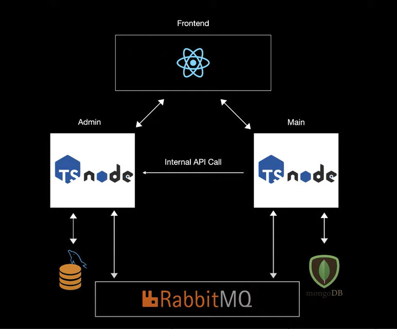

# Basic-Ecommerce-Application-using-Microservice-Architecture-Node-Js-RabbitMq-MongoDB-MySQL

## Full Architecture

# All Endpoints

- ### Admin Service

| Endpoint                   | Functionality           |
| -------------------------- | ----------------------- |
| GET `/api/products/all`    | Get all the products    |
| POST `/api/products/add`   | Create a new product    |
| GET `/api/products/:id`    | Get a single product    |
| PUT `/api/products/:id`    | Update a single product |
| DELETE `/api/products/:id` | Delete a single product |

- ### Main Service

| Endpoint                      | Functionality                   |
| ----------------------------- | ------------------------------- |
| GET `/api/products`           | Get all the products            |
| POST `/api/products/:id/like` | Like or upvote a single product |
